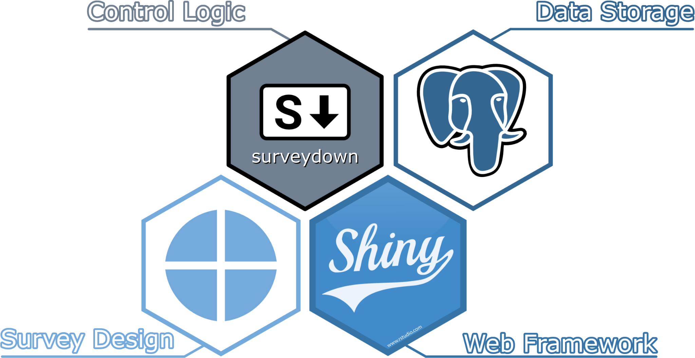

<!-- README.md is generated from README.Rmd. Please edit this file -->

```{r, include = FALSE}
knitr::opts_chunk$set(
  collapse   = TRUE,
  warning    = FALSE,
  message    = FALSE,
  comment    = "#>",
  fig.path   = "man/figures/",
  fig.retina = 3
)
```

## surveydown

<!-- badges: start -->
[](https://CRAN.R-project.org/package=surveydown)
[](https://cran.r-project.org/package=surveydown)
[](https://github.com/surveydown-dev/surveydown)
<!-- badges: end -->

```{markdown}
> [!NOTE]
> Visit our main site at [surveydown.org](https://surveydown.org) for the complete documentation and more information about surveydown.
```

## What is surveydown?

**surveydown** is an open-source, markdown-based platform for
programmable and reproducible Surveys using
[R](https://www.r-project.org/), [Quarto](https://quarto.org/),
[Shiny](https://shiny.posit.co/), and PostgreSQL databases like
[Supabase](https://supabase.com/).

<div align="center">

</div>

<br>

Here's how it works:

1. Design your survey as a [Quarto](https://quarto.org/) document using markdown and R code.
2. Render your survey into a [shiny](https://shiny.posit.co/) app that can be hosted online and sent to respondents.
3. Store survey responses in a PostgreSQL database - we recommend [Supabase](https://supabase.com/) as a free, secure, and easy to use option.

The {surveydown} R package provides functions to bring this all together.

**See the [complete documentation](https://surveydown.org) to get started making your own surveydown survey!**

## Why surveydown?

Most survey platforms (e.g., Google forms, Qualtrics, etc.) use graphic interfaces or spreadsheets to define survey content, making version control, collaboration, and reproducibility difficult or impossible. The surveydown package was designed to address these problems. As an open-source, markdown-based platform, all survey content is defined using **plain text** (markdown and R code) in two files:

- `survey.qmd`: A Quarto document that contains the survey content (pages, questions, etc).
- `app.R`: An R script defining a shiny app that contains global settings (libraries, database configuration, etc.) and server configuration options (e.g., conditional skipping / display, etc.).

This approach makes your survey easy to reproduce, share, and version control with common tools like Git. And since all survey data is stored in a PostgreSQL database, you have total control over where your survey data lives. We provide direct support for [Supabase](https://supabase.com/) as a free, secure, and easy to use option.

In case you're interested in the background behind the project, this [blog post](https://www.jhelvy.com/blog/2023-04-06-markdown-surveys/) provides something of an origin story. Note that the design discussed in the post is now quite outdated with what ultimately became surveydown.

## Installation

### Install R & Quarto

You need both: 

- Install [R](https://CRAN.R-project.org/)
- Install [Quarto](https://quarto.org/)

We also recommend working with an IDE that has good support for R, Quarto, and Shiny.

[RStudio](https://posit.co/products/open-source/rstudio/) is great, and we also like [VSCode](https://github.com/microsoft/vscode) and [Positron](https://github.com/posit-dev/positron).

### Install the {surveydown} R package

You can install {surveydown} from CRAN in your R console:

```{r}
#| eval: false

install.packages("surveydown")
```

or you can install the development version from [GitHub](https://github.com/surveydown-dev/surveydown):

```{r}
#| eval: false

# install.packages("pak")
pak::pak('surveydown-dev/surveydown')
```

Load the package with:

```{r}
#| eval: false

library(surveydown)
```

You can also check which version you have installed:

```{r}
#| eval: false

surveydown::sd_version()
```

## Roadmap

See our [todo](https://github.com/surveydown-dev/todo) repo for a running list of things we're working on / have already added to the project.

## License

See the [License](https://github.com/surveydown-dev/surveydown/blob/master/LICENSE.md).

## Publication

An associated paper in *PLOS One* about this package is available at
[https://doi.org/10.1371/journal.pone.0331002](https://doi.org/10.1371/journal.pone.0331002)

## Citation 

If you use this package in a publication, please cite the *PLOS One* article associated with it! You can get the citation by typing `citation("surveydown")` into R:

```{r}
citation("surveydown")
```

## Funding

This project was partially supported by a grant from the [Alfred P. Sloan Foundation](https://sloan.org/), Grant Number G-2023-20976 awarded to PI John Paul Helveston.
