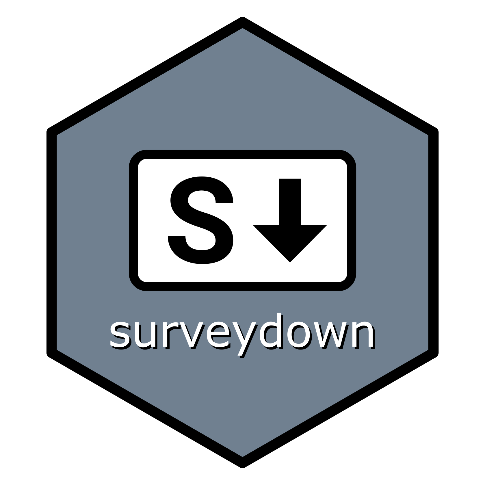
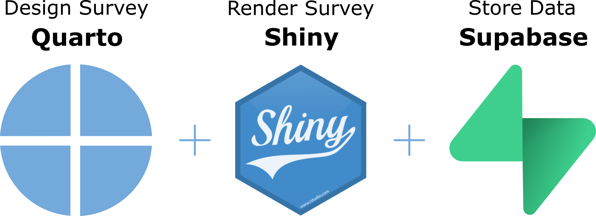

<!-- README.md is generated from README.Rmd. Please edit this file -->

# surveydown 

### Visit our main site [surveydown.org](https://surveydown.org) for more information!

> Note: This is still an early-stage project. Use with caution, and
> please give us feedback!

This package helps you create markdown-based surveys with [Quarto Shiny
Documents](https://quarto.org/docs/dashboards/interactivity/shiny-r.html).
It brings together three open source technologies
([Quarto](https://quarto.org/), [shiny](https://shiny.posit.co/), and
[supabase](https://supabase.com/)) to create dynamic, markdown-based
surveys. Here’s the basic concept:

<br>
<center>

</center>

<br>

1.  Design your survey as a [Quarto shiny
    document](https://quarto.org/docs/dashboards/interactivity/shiny-r.html)
    using markdown and R code.
2.  Render your doc into a [shiny](https://shiny.posit.co/) app that can
    be hosted online and sent to respondents.
3.  Store your survey responses in a [supabase](https://supabase.com/)
    database.

The {surveydown} R package works in tandem with our [surveydown Quarto
extension](https://github.com/jhelvy/surveydown-ext) to make everything
work.

**See the [documentation](https://surveydown.org) to get started making
your own surveydown survey!**

# Background & Motivation

Most survey platforms (e.g., Google forms, Qualtrics, etc.) use
drag-and-drop interfaces to design surveys, making version control and
collaboration with others difficult. They’re also not reproducible.

As an open-source, markdown-based platform, surveydown was designed to
address these problems. In surveydown, all survey content is created
with plain text (markdown and R code) in a single .qmd file that renders
into a shiny app. This makes your survey easy to reproduce, share, and
version control with common tools like Git. The resulting shiny app for
each survey can be hosted on a number of platforms, like
[shinyapps.io](https://shinyapps.io/) or
[huggingface](https://huggingface.co/), and the survey data collected is
owned by the survey designer in a supabase account. Best of all,
everything is open source and free :)

If you’re curious where this whole idea came from, check out this [blog
post](https://www.jhelvy.com/blog/2023-04-06-markdown-surveys/), which
outlines more on the general idea and the motivation for it. The post is
now outdated in terms of the overall design, but it provides something
of an origin story and some of the motivation for developing this
project.

# TODO List

This is a running list of things we’re working on adding to the project:

- [x] show_if (conditionally display question)
- [x] skip_if (conditionally skip to page)
- [x] Set defaults for questions to not have any choices selected on
  launch.
- [x] Ability to embed markdown inside choice options (like mc buttons
  in formr)
- [x] Option for `preview = TRUE` (database is ignored)
- [x] Export timestamps on each page in the data
- [x] Export timestamps on each question interaction (since this will
  increase the data size considerably, maybe add this as
  `question_times = FALSE` argument)
- [x] Option to start at a designated page,
  e.g. `start_page = 'page_name'`
- [x] A `show_all = TRUE` argument to show all the pages and hidden
  questions when launched (e.g. to be able to print out the entire
  survey text). Could also be called `print_mode = TRUE`.
- [x] Set up SCSS to be compatible with Quarto-supported bootstrap
  themes
- [x] Add an optional progress bar
- [x] Include input checks for `skip_if` and `show_if` (`question_id`
  exists, and data frame names are correct)
- [x] Required questions (`required = TRUE`): post a popup if a question
  is required before allowing next button. Default should be
  `required = FALSE`.
- [x] Add a `sd_get_data()` function so the survey designer can obtain
  the current survey results from inside the app:
  <https://shinysurveys.jdtrat.com/articles/get-survey-data.html>
- [x] Admin page w/password to preview / download data (see
  <https://github.com/daattali/shinyforms>)
- [x] Ability to pass url parameters, e.g. for tracking users.
- [x] Ability to redirect users to another url.
- [ ] Form validation: Make sure the user inputs the correct type
  depending on the question type. (see
  <https://shiny.posit.co/r/reference/shiny/0.14/validate.html>)
- [ ] Deal with cookies so users who close the browser can start back
  where they left off.
- Question types:
  - [x] Multiple choice (single choice)
  - [x] Multiple choice (multiple choices)
  - [x] Select
  - [x] Text
  - [x] Numeric
  - [x] Multiple choice (button…like formr mc_button)
  - [x] Text area
  - [x] Date
  - [ ] Matrix
  - [ ] Slider

Resources / other related examples:

- [shinysurveys](https://github.com/jdtrat/shinysurveys)
- [shinyforms](https://github.com/daattali/shinyforms)

## [License Information](https://github.com/jhelvy/surveydown/blob/master/LICENSE.md)

## Citation Information

If you use this package for in a publication, please cite it! You can
get the citation by typing `citation("surveydown")` into R:

``` r
citation("surveydown")
```
