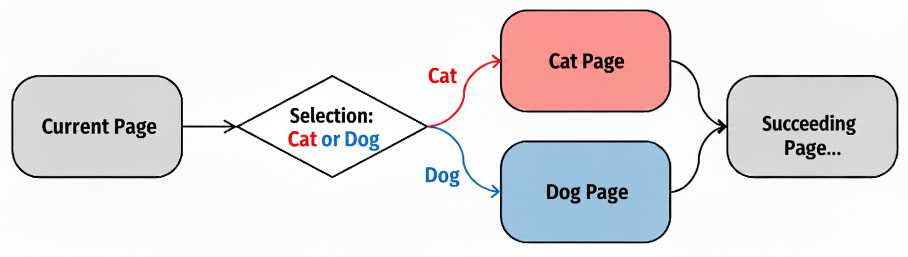

---
# The YAML header specifies several settings for the survey but is not required.
# A full list of settings can be found under _survey/settings.yml directory.

theme-settings:
  theme: default
  barposition: top
  footer-left: "Made with [surveydown](https://surveydown.org)"
  footer-right: '[<i class="bi bi-github"></i> Source Code](https://github.com/surveydown-dev/template_conditional_showing)'

survey-settings:
  mode: preview
  show-previous: true
  use-cookies: false
  auto-scroll: false
  rate-survey: false
  system-language: en
  highlight-unanswered: true
  highlight-color: blue
  capture-metadata: true
  all-required: false
---

```{r}
library(surveydown)
```

--- welcome

# Template - Conditional Showing

::: {.callout-tip}
For this template, we didn't provide any `required_questions` in the YAML header. However, the questions that are used for judging are automatically set to be required.
:::

Hi! This is a showcase of the "conditional showing" feature that surveydown supports.

It consists of:

1. Simple conditional showing
2. Complex conditional showing
3. Conditional showing based on a numeric value
4. Conditional showing based on multiple inputs
5. Conditional showing based on a custom function
6. Conditional showing for pages
7. Cross-page conditional showing (`input$` and `all_data$` syntax)

Please proceed to the next page.

--- basic_showif

## 1. Simple conditional showing

If the "**Other**" option is chosen, a question asking the other penguin type will appear.

This is done by using the `sd_show_if()` function in the `server` of `app.R`.

```{r}
sd_question(
  type  = 'mc',
  id    = 'penguins_simple',
  label = "Which is your favorite type of penguin?",
  option = c(
    'Adélie'    = 'adelie',
    'Chinstrap' = 'chinstrap',
    'Gentoo'    = 'gentoo',
    'Other'     = 'other'
  )
)

sd_question(
  type  = "text",
  id    = "penguins_simple_other",
  label = "Please specify the other penguin type:"
)
```

--- custom_showif

## 2. Complex conditional showing

Say that we want to have a more complicated `show_if` condition. Now there are 2 questions. Only if the user chooses both "**Other**" and "**Show**" will the other penguin question appear. This is also done by using the `sd_show_if()` function in the `server` of `app.R`.

```{r}
sd_question(
  type  = 'mc',
  id    = 'penguins_complex',
  label = "Which is your favorite type of penguin?",
  option = c(
    'Adélie'    = 'adelie',
    'Chinstrap' = 'chinstrap',
    'Gentoo'    = 'gentoo',
    'Other'     = 'other'
  )
)

sd_question(
  type  = 'mc',
  id    = 'show_other',
  label = "Should we show the 'other' option question?",
  option = c(
    'Show' = 'show',
    'Hide' = 'hide'
  )
)

sd_question(
  type  = "text",
  id    = "penguins_complex_other",
  label = "Please specify the other penguin type:"
)
```

--- numeric_show_if

## 3. Conditional showing based on a numeric value

Sometimes you may want to show a question based on a user input value. In the question below, if you type in a value greater than **1**, you'll see the conditional question.

::: {.callout-note}
In surveydown, all input values are stored as string. In the `sd_show_if()` function, use `as.numeric()` to wrap your input in order to change the data type into numeric.
:::

```{r}
sd_question(
  type  = "numeric",
  id    = "car_number",
  label = "How many cars do you have in your household?"
)

sd_question(
  type   = "mc",
  id     = "ev_ownership",
  label  = "Is your backup car a gasoline car or an EV?",
  option = c(
    "Gasoline" = "gasoline",
    "EV"  = "ev"
  )
)
```

--- multi_show_if

## 4. Conditional showing based on multiple inputs

In other cases, you might show a question based on multiple user input values. The conditions are explained below:

1. If you pick either Apple or Banana, you'll be popped with a question asking how many apples/bananas do you eat per day.
2. If you pick more than 3 types, you'll be popped with a question as well.

```{r}
sd_question(
  type  = "mc_multiple_buttons",
  id    = "fav_fruits",
  label = "Pick your favorite fruit(s):",
  option = c(
    "Apple"  = "apple",
    "Banana" = "banana",
    "Peach"  = "peach",
    "Orange" = "orange",
    "Grape"  = "grape"
  )
)

sd_question(
  type   = "mc_buttons",
  id     = "apple_or_banana",
  label  = glue::glue("How many {sd_output('fav_fruits', type = 'value')}(s) do you eat in a day?"),
  option = seq(1,5)
)

sd_question(
  type   = "mc_buttons",
  id     = "fruit_number",
  label  = "You picked a lot of fruit types. How many do you eat in a day?",
  option = seq(1,5)
)
```

--- custom_function

## 5. Conditional showing based on a custom function

Here I only want to show the car type question if the user owns more than 1 car. If you input a number greater than 1 in the car number question, the car type question will appear.

```{r}
sd_question(
  type  = "numeric",
  id    = "pet_number",
  label = "How many pet(s) do you have in your household?"
)

sd_question(
  type  = "text",
  id    = "pet_type",
  label = "Please specify your pet type(s):"
)
```

--- conditional_page

## 6. Conditional page showing

The `sd_show_if()` function can also be used to conditionally show a page. In this example, if you choose "**Cat**" in the question below, you'll be directed to a cat-related page, and same for the "**Dog**" selection. No matter which option you choose, you won't see the other page.

The flow chart below illustrates how the conditional page showing works:

<center>

</center>

<br>

```{r}
sd_question(
  type  = 'mc',
  id    = 'pet_preference',
  label = "Which pet do you prefer, cat or dog?",
  option = c(
    'Cat' = 'cat',
    'Dog' = 'dog'
  )
)
```

--- cat_page

## Cat Page

This is the cat page because you chose "**Cat**" in the previous question. You won't see the dog page.

<center>

</center>

<br>

--- dog_page

## Dog Page

This is the dog page because you chose "**Dog**" in the previous question. You won't see the cat page.

<center>

</center>

<br>

--- cross_page

## 7. Cross-page conditional showing

The question controlling a `show_if` condition doesn't have to be on the same page as its target. Answer the question below, then proceed to the next page. Two conditional questions there are controlled by your answer here — one defined with the `input$` syntax and one with the `all_data$` syntax in `sd_show_if()`.

Since this survey has `show-previous: true`, you can also navigate back here, change your answer, and confirm the questions on the next page appear or disappear accordingly.

```{r}
sd_question(
  type  = 'mc',
  id    = 'snow_preference',
  label = "Do you like snow?",
  option = c(
    'Yes' = 'yes',
    'No'  = 'no'
  )
)
```

--- cross_page_targets

## Cross-page conditional questions

If you chose "**Yes**" on the previous page, two questions appear below. If you chose "**No**", this page only shows this text.

```{r}
sd_question(
  type  = "text",
  id    = "snow_activity",
  label = "(Shown via `input$` syntax) What's your favorite snow activity?"
)

sd_question(
  type  = "text",
  id    = "snow_memory",
  label = "(Shown via `all_data$` syntax) Describe a favorite snow memory:"
)
```

--- end

## This is the end of the survey template of the conditional showing feature.

```{r}
sd_close()
```