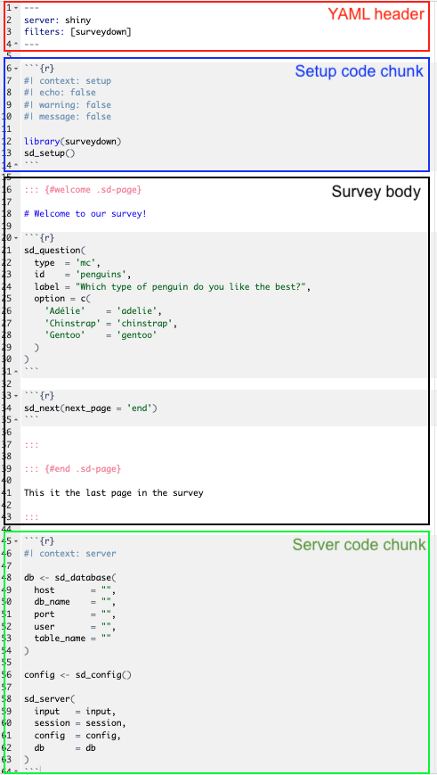

```{r setup, include=FALSE, message=FALSE, warning=FALSE}
knitr::opts_chunk$set(
  collapse = TRUE,
  warning = FALSE,
  message = FALSE,
  eval = FALSE,
  fig.retina = 3,
  comment = "#>"
)

library(surveydown)
```

# Quick overview

In {surveydown}, your entire survey is designed using markdown and R code in a single Quarto document (a `.qmd` file). The {surveydown} package provides a set of functions for defining the survey content and control logic. Each function starts with `sd_` to make them easy to identify.

To edit your survey, you can add text using markdown formatting, or in RStudio you can edit with the visual editor. Survey questions are defined in R code chunks with the `sd_question()` function. Pages are defined using fences (`:::`), and navigation buttons handled with the `sd_next()` function. You can modify the control logic in the server code chunk (the last code chunk at the bottom of the .qmd file) with the `sd_config()` function, and you can configure the database with the `sd_database()` (these are each detailed in separate guides - see [Control Logic](control_logic.html) and [Database Setup](database_setup.html)).

The remainder of this guide covers how to add content to your survey.

# Start with a template

In the R console, run the following to to setup a template survey:

```{r}
surveydown::sd_create_survey("path/to/folder")
```

This will create a folder located at `"path/to/folder"` with the following files:

- `example.qmd`: a template survey you should edit.
- `example.Rproj`: An RStudio project file (helpful if you're working in RStudio)
- `_extensions`: A folder with the [surveydown Quarto extension](https://github.com/jhelvy/surveydown-ext) needed to make everything work (don't modify this).

> Every survey created with {surveydown} should be in its own separate project folder.

# Survey components

Every {surveydown} survey is configured in a single `.qmd` file that consists of **4 parts**: 

1. A YAML header.
2. A setup code chunk.
3. The survey body. 
4. A server code chunk. 

```{r out.width = '70%', echo = FALSE, eval=TRUE}

```

# 1. YAML Header

The YAML header is at the top of the `.qmd` file. In addition to two required elements, the YAML can be used to set the survey theme as well as modify the survey progress bar. 

## Required YAML content

For a surveydown survey, your YAML must contain at least the following:

``` yaml
---
server: shiny
filters: [surveydown]
---
```

The `server: shiny` part ensures that the document will render as a shiny app. The `filters: [surveydown]` part applies the surveydown Quarto extension to the project, which is required.

## Setitng the theme 

The YAML can also be used to set several **optional** global settings, such as the overall survey `theme`:

``` yaml
---
theme: united # Any bootswatch theme 
---
```

There are [25 bootswatch themes](https://bootswatch.com) to choose from. You can also provide a `custom.scss` file to further modify the theme, or even combine the two, e.g.:

``` yaml
---
theme: [united, custom.scss]
---
```

## Progress bar

You can modify the survey progress bar with the `barcolor` and `barposition` keys, e.g.:

``` yaml
---
barcolor: theme 
barposition: top 
---
```

The `barcolor` key defines the color of the progress bar. It defaults to `theme`, meaning it will take the primary theme color. You may also use any hex code to overwrite this color as you wish, e.g.: `#768692`.

The `barposition` key defines the position of the progress bar. It defaults to `top`, but can also be changed to `bottom` or `none` (to remove the bar). The progress bar updates on every **question** the user clicks on, not pages.

# Setup code chunk

After the YAML header, you'll need to load the `surveydown` package and run the `sd_setup()` function. This should be placed inside a code chunk that looks like this:

```{r}
#| echo: fenced
#| context: setup
#| warning: false
#| message: false

# Load the package
library(surveydown)

# Run initial setup function (essential - do not delete)
sd_setup()
```


# Adding pages

In surveydown, pages are delineated using "fences", like this:

```
::: {#welcome .sd-page}

Page 1 content here

:::

::: {#page2 .sd-page}

Page 2 content here

:::
```

As you can see, we use three colon symbols `:::`, called a "fence", to mark the start and end of pages. This notation is commonly used in Quarto for a variety of use cases, like defining [subfigures](https://quarto.org/docs/authoring/figures.html#subfigures) in images.


In the starting fence, you need to define a page name (e.g. `welcome` and `page2` in the example above) and you need to define the class as `.sd-page`. Then anything you put between the page fences will appear on that page. 

To navigate to the next page, you need to insert a `sd_next()` function call inside a code chunk, like this: 

```{r}
#| echo: fenced

sd_next(next_page = 'page2')
```

The above code chunk will create a "Next" button that goes on to page 2 that looks like this:

```{r}
#| eval: true
#| echo: false

sd_next(next_page = 'page2')
```

You would need to place the code chunk in between the `:::` fences of the `welcome` page in order to have a "Next" button that goes on to page 2. You can also send the user to other pages by just changing the `next_page` argument. Finally, you can also change the label of the button by changing the `label` argument, like this:

```{r}
#| echo: fenced

sd_next(next_page = 'page2', label = 'Next page')
```

```{r}
#| eval: true
#| echo: false

sd_next(next_page = 'page2', label = 'Next page')
```

# Adding questions

Every survey question is created using the `sd_question()` function inside a code chunk. The question type is defined by the `type` argument. For example, to add a multiple choice question, you could insert the following code chunk:


```{r}
#| echo: fenced

sd_question(
  type  = 'mc',
  id    = 'penguins',
  label = "Which is your favorite type of penguin?",
  option = c(
    'Adélie'    = 'adelie',
    'Chinstrap' = 'chinstrap',
    'Gentoo'    = 'gentoo'
  )
)
```

The above code chunk will create a multiple choice question that looks like this:

```{r}
#| eval: true
#| echo: false

sd_question(
  type  = 'mc',
  id    = 'penguins',
  label = "Which is your favorite type of penguin?",
  option = c(
    'Adélie'    = 'adelie',
    'Chinstrap' = 'chinstrap',
    'Gentoo'    = 'gentoo'
  )
)
```

The `sd_question()` function can be used to create a variety of [question types](https://jhelvy.github.io/surveydown/articles/question_types.html), like text input, select drop down choices, and more by changing the `type` argument.

The function has many other arguments for customizing the look and feel of the question (e.g., `height` and `width`, etc.) as well as a `required` argument that can be used to make a question required or optional (e.g., `required = TRUE`).

# The server chunk

At the very bottom of the .qmd file is a special "server" code chunk (that's the `#| context: server` bit) that defines the app server. This is where you can customize and control the survey flow logic as well as where you define the database that will store the survey response data. It looks like this:

```{r}
#| echo: fenced
#| context: server

# Define the database settings
db <- sd_database()

# Define the configuration settings
config <- sd_config()

# The sd_server() function initiates your survey - don't change this
sd_server(
  input   = input,
  session = session,
  config  = config,
  db      = db
)
```

The `sd_server()` function at the bottom makes everything run, which you can safely ignore - just don't change it and all will be good!

The `sd_database()` function is where you set up your database. See the [Database Setup](database_setup.html) page for details on how to configure your database.

The `sd_config()` function is where you can define custom control logic for the survey, such as *conditional display* (conditionally displaying a question based on responses to questions), or *conditional skip* (conditionally sending the respondent to a page based on responses to questions). See the the [Control Logic](control_logic.html) page for details on how to configure the control logic.


## 3. Survey Body

Now you are ready to start writing your survey contents. You can write markdown texts for explanations and instructions, and insert R code chunks to present survey questions.

Here is a question to get started. This question showcases what a "multiple choice" question looks like, which is created using `type = 'mc'` inside the `sd_question()` function.

It also is an example of the `show_if` feature (conditional display). If you choose the "Other" option, a second question pops up below asking to specify which other type of penguin is your favorite. This is a **conditional question** and is controlled with the `show_if` argument to the `sd_config()` function defined in the server section at the bottom of the `.qmd` file, which will be described in [4. Server Codes].

```{r eval=FALSE}
# A multiple choice question with an "Other" option
sd_question(
  type  = 'mc',
  id    = 'penguins',
  label = "Which is your favorite type of penguin?",
  option = c(
    'Adélie'    = 'adelie',
    'Chinstrap' = 'chinstrap',
    'Gentoo'    = 'gentoo',
    
    # This "Other" option triggers the "penguins_other" question
    'Other'     = 'other'
  )
)

# Controlled by the show_if argument of sd_config()
sd_question(
  type  = "text",
  id    = "penguins_other",
  label = "Please specify the other penguin type:"
)
```

Screenshot for an ordinary option being chosen:

::: {style="text-align: left; max-width: 300px;"}
{width="300"}
:::

Screenshot for the "**Other**" option being chosen:

::: {style="text-align: left; max-width: 300px;"}
{width="300"}
:::

## 4. Server Codes

The server codes are at the very bottom of the `qmd` file. It consists of 3 parts:

1.  A `db` variable, short for "database", defined by the `sd_database()` function.
2.  A `config` variable, defined by the `sd_config()` function. It takes in arguments of `show_if` and `skip_if`. In `show_if`, you can define an option to trigger an conditional question; in `skip_if`, you define the option to jump over to a designated page.
3.  Calling the `sd_server()` function with fixed arguments. This part is essential and has to be the same for every survey project.

## 4.1 Template

Below is a template for the server codes:

```{r eval=FALSE}
#| context: server

# See instructions in supabase setup
db <- sd_database(
  host       = "your_supabase_host",
  db_name    = "your_supabase_db_name",
  port       = "your_supabase_port",
  user       = "your_supabase_user",
  table_name = "your_customed_table",
  password   = Sys.getenv("your_supabase_password")
)

# Define skip_if and show_if
config <- sd_config(
  skip_if = tibble::tribble(
    ~question_id,  ~question_value, ~target,
    "skip_to_page", "end",           "end",
    "skip_to_page", "question_formatting",  "questionFormatting"
  ),
  show_if = tibble::tribble(
    ~question_id,  ~question_value, ~target,
    "penguins",    "other",         "penguins_other"
  )
)

# The scripts below are essential
sd_server(
  input   = input,
  session = session,
  config  = config,
  db      = db
)
```

## 4.2 `show_if`

Back to our example: in order for the conditional question to show once the "Other" option is selected, you'll need to define it in the `show_if` argument under the `sd_config()` function.

```{r eval=FALSE}
config <- sd_config(
  show_if = tibble::tribble(
    ~question_id,  ~question_value, ~target,
    "penguins",    "other",         "penguins_other"
    )
)
```

In the scripts above, we use a `tribble` to define the `show_if` algorithm. We have `question_id` being "`penguins`", indicating the `show_if` algorithm takes effect for the question with id being "`penguins`". The `question_value` is "`other`", and the revealed question has id of "`penguins_other`".

By doing this, we successfully triggered the "`penguins_other`" question upon selection of "`other`" in the question "`penguins`". This is essentially important if you want participants to type in their personalized answers that are not listed in your options.

## 4.3 `skip_if`

The `skip_if` argument works similarly as `show_if`. You indicate its functional `question_id`, set the `question_value` (aka the option) to trigger the page jump, and set the `target` value as the landing page.

```{r eval=FALSE}
config <- sd_config(
  show_if = tibble::tribble(
    ~question_id,  ~question_value, ~target,
    "skip_to_page", "end",           "end"
    )
)
```

In the example above, the question with ID being "`skip_to_page`" has an option of "`end`". By clicking on it, you'll be directed to the page with ID of "`end`".

::: {style="text-align: left; max-width: 400px;"}
{width="400"}
:::

# Page Arrangement

## 1. Example

`surveydown` utilizes Shiny to arrange the pages. See the example below as a template for page setup.

```{r eval = FALSE}
::: {#page_1 .sd-page}
# Page 1

Sample question

sd_question(
  type  = 'mc',
  id    = 'mc_question',
  label = "What's your favorite color?",
  option = c(
    'Red'    = 'red',
    'Blue'   = 'blue',
    'Orange' = 'orange'
  )
)

<br>

sd_next(next_page = 'page_2')
:::

::: {#page_2 .sd-page}
# Page 2

This is page 2

<br>

sd_next(next_page = 'end')
:::

::: {#end .sd-page}
## Thanks for taking our survey!
:::
```

