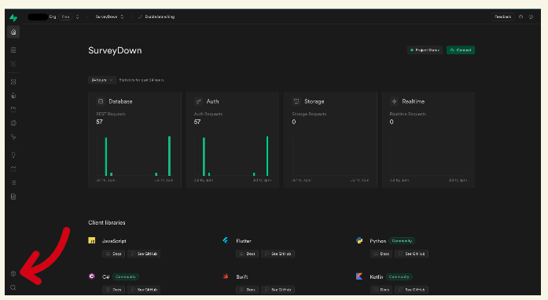
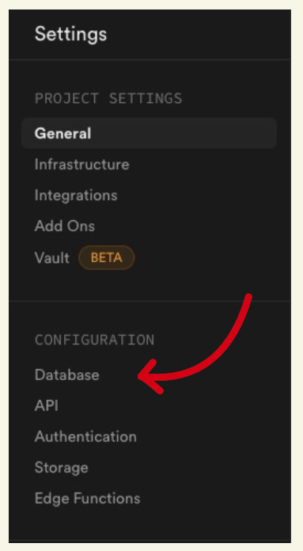

```{r}
#| label: setup
#| include: false
#| message: false
#| warning: false

knitr::opts_chunk$set(
  collapse = TRUE,
  warning = FALSE,
  message = FALSE,
  eval = FALSE,
  fig.retina = 3,
  comment = "#>"
)
```

> This guide will help users set up a supabase account to work inside of SurveyDown 
for quick & live server updates

# Step 1: Create your account

Navigate to [supabase](https://supabase.com/) website and create an account.

# Step 2: Start a project

From the Main page, select "Start your Project" underlined in red.


# Step 3: Create a project

After creating your new account proceeding to your dashboard, select "New Project".


# Step 4: Create a database

The next step is to create your respective database. Here you **must** use the password you created for your survey project (see `vignette("password")`).


# Step 5: Find the DB parameters

While on your project dashboard select the settings gear in the bottom left, then select "Database".





# Step 6: Copy the DB parameters

Copy the all of the connection parameters to your database.


# Step 7: Update the arguments in `sd_database()`

Now that we've created our database and have gotten all the needed parameters we can now connect the database to our survey.

Taking a look at our code inside of our **survey.qmd** file you will notice five arguments in `sd_database()`. This is where you will replace the `NULL` values with the ones you copied from your database. The last argument, `table_name`, can be any name of your choosing.

```{r}
db <- sd_database(
  host       = NULL,
  db_name    = NULL,
  port       = NULL,
  user       = NULL,
  table_name = NULL
)
```

If you don't have a database setup yet, you can just leave the function blank and your survey will still run, just without any response data being stored:

```{r}
db <- sd_database()
```

# Example

An example of what the function should look like after you have updated all the parameters is below:

```{r}
db <- sd_database(
  host       = "aws-0-us-west-1.pooler.supabase.com", 
  db_name    = "postgres", # For the purpose of supabase, this will always be "postgres".
  port       = "1234", 
  user       = "postgres.UserValue",
  table_name = "my_table_name"
)
```

# Tada!!!

Going back to your Project dashboard and selecting *"Table Editor"* on the left hand bar tab you should see your table appear once your survey is run and interacted with atleast once.

