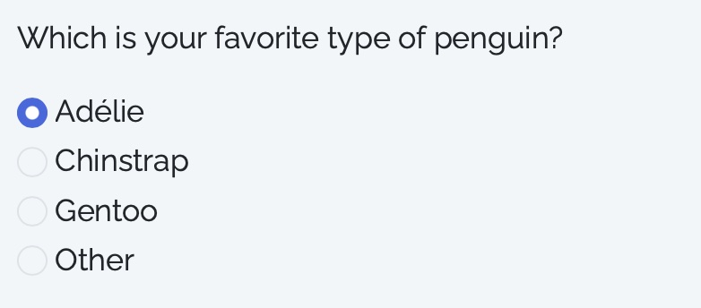
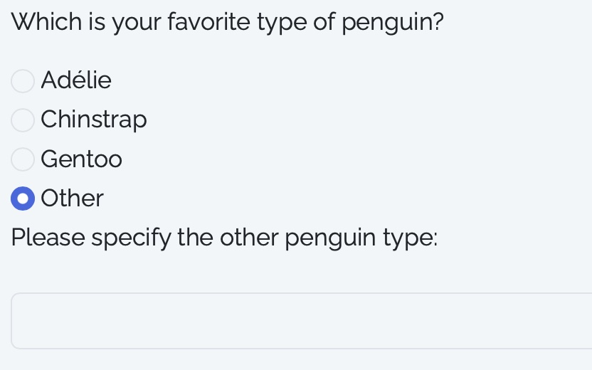

```{r setup, include=FALSE, message=FALSE, warning=FALSE}
knitr::opts_chunk$set(
  collapse = TRUE,
  warning = FALSE,
  message = FALSE,
  fig.retina = 3,
  comment = "#>"
)
```

# Introduction & installation

surveydown is a tool for building and deploying surveys using [**Quarto Shiny documents**](https://quarto.org/docs/dashboards/interactivity/shiny-r.html).

Before jumping in, check out the [installation instructions](https://jhelvy.github.io/surveydown/articles/installation.html) to make sure you have everything installed and set up properly.

# Start with a template

We recommend using the `surveydown::sd_create_survey()` function to start with a template (including the extension):

```{r}
#| eval: false

# To install the survey under your current path
surveydown::sd_create_survey()

# To designate a path inside your current path
surveydown::sd_create_survey("path/to/folder")
```

You can either leave the argument blank to install the template in your current directory, or replace `"path/to/folder"` with the path where you want to create your template surveydown project.

> Every survey created with {surveydown} should be in its own separate project folder.

Once you've created a template survey to work with, you'll notice a `_extensions` folder. Inside that folder, there is a `surveydown` folder containing the [surveydown Quarto extension](https://github.com/jhelvy/surveydown-ext), which is required to make everything work. **Make sure you keep that folder in the root of your project** to keep everything working properly :)

# Basic Use

Our HTML survey page is constructed using a `.qmd` file (aka a Quarto Doc file). This file consists of **4 parts: a YAML header, a setup code chunk, the survey body, and a server code chunk in the end**. Please see explanation below.

## 1. YAML Header

YAML (Yet Another Markup Language) is an essential part for all `.qmd` files. It regulates the basic settings, including page layout, themes, add-on `css` or `js` files, etc., of your HTML page. These settings are called **keys**.

Below are the **essential** YAML scripts for the surveydown project. It contains two keys: `server`, and `filters`.

``` yaml
---
server: shiny
filters: [surveydown]
---
```

The `server: shiny` key designates the Shiny server to our page, and `filters: [surveydown]` applies the surveydown Quarto extension.

Below are the **optional** YAML scripts that you may use:

``` yaml
---
theme: united # Any bootswatch theme or a customized scss file
barcolor: theme # "theme" (default) or a customized hex code
barposition: top # "top" (default), "bottom", or "none" 
---
```

There are [25 bootswatch themes](https://bootswatch.com) to choose from. You can also use our customized `scss` theme file, or even combine these two. An example combination is shown below:

``` yaml
---
theme: [united, custom.scss]
---
```

It means to use the [united bootswatch theme](https://bootswatch.com/united/), and overwrite with the `custom.scss` file. For example, if you don't like the orange primary color of this theme, you can define `$primary` as something else in your own `scss` file. We've prepared a `custom.scss` file in our [surveydown demo repo](https://github.com/jhelvy/surveydown_demo) on GitHub.

The `barcolor` key defines the color of the progress bar. It's default to "`theme`", meaning it will reflect any primary color that the theme defines. You may also use any hex codes to overwrite this color as you wish.

The `barposition` key defines the position of the progress bar. It's default to "`top`", meaning the bar will be on the top of the page. You can change to "`bottom`" or "`none`".

You may define other YAML scripts if you want to further customize the layout of your HTML page.

## 2. Setup Codes

After the YAML header, you'll need to load the `surveydown` package and run the `sd_setup()` function:

```{r eval=FALSE}
library(surveydown)
sd_setup()
```

## 3. Survey Body

Now you are ready to start writing your survey contents. You can write markdown texts for explanations and instructions, and insert R code chunks to present survey questions.

Here is a question to get started. This question showcases what a "multiple choice" question looks like, which is created using `type = 'mc'` inside the `sd_question()` function.

It also is an example of the `show_if` feature (conditional display). If you choose the "Other" option, a second question pops up below asking to specify which other type of penguin is your favorite. This is a **conditional question** and is controlled with the `show_if` argument to the `sd_config()` function defined in the server section at the bottom of the `.qmd` file, which will be described in [4. Server Codes].

```{r eval=FALSE}
# A multiple choice question with an "Other" option
sd_question(
  type  = 'mc',
  id    = 'penguins',
  label = "Which is your favorite type of penguin?",
  option = c(
    'Adélie'    = 'adelie',
    'Chinstrap' = 'chinstrap',
    'Gentoo'    = 'gentoo',
    
    # This "Other" option triggers the "penguins_other" question
    'Other'     = 'other'
  )
)

# Controlled by the show_if argument of sd_config()
sd_question(
  type  = "text",
  id    = "penguins_other",
  label = "Please specify the other penguin type:"
)
```

Screenshot for an ordinary option being chosen:

::: {style="text-align: left; max-width: 300px;"}
{width="300"}
:::

Screenshot for the "**Other**" option being chosen:

::: {style="text-align: left; max-width: 300px;"}
{width="300"}
:::

## 4. Server Codes

The server codes are at the very bottom of the `qmd` file. It consists of 3 parts:

1.  A `db` variable, short for "database", defined by the `sd_database()` function.
2.  A `config` variable, defined by the `sd_config()` function. It takes in arguments of `show_if` and `skip_if`. In `show_if`, you can define an option to trigger an conditional question; in `skip_if`, you define the option to jump over to a designated page.
3.  Calling the `sd_server()` function with fixed arguments. This part is essential and has to be the same for every survey project.

## 4.1 Template

Below is a template for the server codes:

```{r eval=FALSE}
#| context: server

# See instructions in supabase setup
db <- sd_database(
  host       = "your_supabase_host",
  db_name    = "your_supabase_db_name",
  port       = "your_supabase_port",
  user       = "your_supabase_user",
  table_name = "your_customed_table",
  password   = Sys.getenv("your_supabase_password")
)

# Define skip_if and show_if
config <- sd_config(
  skip_if = tibble::tribble(
    ~question_id,  ~question_value, ~target,
    "skip_to_page", "end",           "end",
    "skip_to_page", "question_formatting",  "questionFormatting"
  ),
  show_if = tibble::tribble(
    ~question_id,  ~question_value, ~target,
    "penguins",    "other",         "penguins_other"
  )
)

# The scripts below are essential
sd_server(
  input   = input,
  session = session,
  config  = config,
  db      = db
)
```

## 4.2 `show_if`

Back to our example: in order for the conditional question to show once the "Other" option is selected, you'll need to define it in the `show_if` argument under the `sd_config()` function.

```{r eval=FALSE}
config <- sd_config(
  show_if = tibble::tribble(
    ~question_id,  ~question_value, ~target,
    "penguins",    "other",         "penguins_other"
    )
)
```

In the scripts above, we use a `tribble` to define the `show_if` algorithm. We have `question_id` being "`penguins`", indicating the `show_if` algorithm takes effect for the question with id being "`penguins`". The `question_value` is "`other`", and the revealed question has id of "`penguins_other`".

By doing this, we successfully triggered the "`penguins_other`" question upon selection of "`other`" in the question "`penguins`". This is essentially important if you want participants to type in their personalized answers that are not listed in your options.

## 4.3 `skip_if`

The `skip_if` argument works similarly as `show_if`. You indicate its functional `question_id`, set the `question_value` (aka the option) to trigger the page jump, and set the `target` value as the landing page.

```{r eval=FALSE}
config <- sd_config(
  show_if = tibble::tribble(
    ~question_id,  ~question_value, ~target,
    "skip_to_page", "end",           "end"
    )
)
```

In the example above, the question with ID being "`skip_to_page`" has an option of "`end`". By clicking on it, you'll be directed to the page with ID of "`end`".

::: {style="text-align: left; max-width: 400px;"}
{width="400"}
:::

# Page Arrangement

## 1. Example

`surveydown` utilizes Shiny to arrange the pages. See the example below as a template for page setup.

```{r eval = FALSE}
::: {#page_1 .sd-page}
# Page 1

Sample question

sd_question(
  type  = 'mc',
  id    = 'mc_question',
  label = "What's your favorite color?",
  option = c(
    'Red'    = 'red',
    'Blue'   = 'blue',
    'Orange' = 'orange'
  )
)

<br>

sd_next(next_page = 'page_2')
:::

::: {#page_2 .sd-page}
# Page 2

This is page 2

<br>

sd_next(next_page = 'end')
:::

::: {#end .sd-page}
## Thanks for taking our survey!
:::
```

## 2. Quarto Fences

Quarto doc uses **fences**, embraced by 2 sets of three colons `:::`, to regulate elements in a page, similar to the `<div>` section in HTML pages. The curly braces followed by the opening set of `:::` regulates the css settings of this fence. Therefore, a basic framework of a surveydown page is like this:

```{r eval = FALSE}
::: {#page_1 .sd-page}

Some contents

<br>

sd_next(next_page = 'page_2')
:::
```

## 3. css Settings

In the css settings, `#page_1` indicates the name (or ID) of this page is `page_1`. It is an important identifier for the `sd_next()` and `sd_config()` functions:

-   The `sd_next()` function regulates the designed page flow.

-   The `sd_config()` function, as explained in [4. Server Codes], containing `skip_if` and `show_if` values, regulates the skipped landing and conditional revealing of the pages, respectively.

If you've reached the ending page, the `sd_next()` function is unnecessary. Otherwise, use this function to regulate the page flow. The above example writes `sd_next(next_page = 'page_2')`, meaning the next page will be `page_2`.

The `.sd-page` class is pre-defined in `surveydown`'s internal css. It means this **fenced element** is treated as a `surveydown` page. Please include this in your page setting.

We include an HTML line break `<br>` so that the next page button does not directly contact the previous line.
