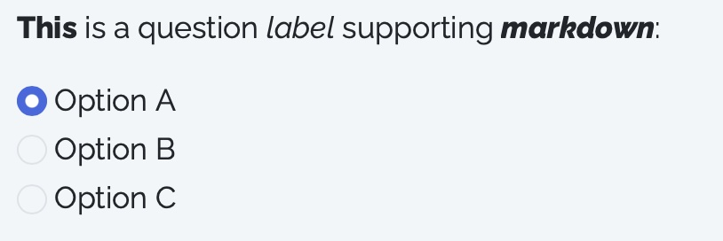

```{r setup, include=FALSE, message=FALSE, warning=FALSE}
knitr::opts_chunk$set(
  collapse = TRUE,
  warning = FALSE,
  message = FALSE,
  fig.retina = 3,
  comment = "#>"
)
```

> On this page, we’ll demonstrate some of the formatting options for displaying questions.

## Markdown

**Markdown** is supported for the **question label**.

The `label` argument for any question type can accept markdown formatting. For example, the question below uses the `**` symbols to make some works bold.

Scripts:

```{r eval=FALSE}
sd_question(
  type   = 'mc',
  id     = 'markdown_label',
  label  = "**This** is a question *label* supporting ***markdown***:",
  option = c(
    "Option A" = "option_a",
    "Option B" = "option_b",
    "Option C" = "option_c"
  )
)
```

Output:

::: {style="text-align: left; max-width: 300px;"}
{width="300"}
:::

**Markdown** is also supported for options in `mc_buttons` questions.

For `mc_button` type questions, you can also use markdown to format the `option` labels.

Scripts:

```{r eval=FALSE}
sd_question(
  type   = 'mc_buttons',
  id     = 'markdown_buttons',
  label  = "The 3 options below support markdown:",
  option = c(
    "*Option A*"     = "option_a",
    "**Option B**"   = "option_b",
    "***Option C***" = "option_c"
  )
)
```

Output:

::: {style="text-align: left; max-width: 300px;"}
{width="300"}
:::

The same is true for `mc_multiple_buttons`.

Scripts:

```{r eval=FALSE}
sd_question(
  type   = 'mc_multiple_buttons',
  id     = 'markdown_multiple_buttons',
  label  = "The 3 options below support markdown:",
  option = c(
    "*Option A*"     = "option_a",
    "**Option B**"   = "option_b",
    "***Option C***" = "option_c"
  )
)
```

Output:

::: {style="text-align: left; max-width: 300px;"}
{width="300"}
:::

## HTML

**HTML** is supported for options of `mc_buttons` and `mc_multiple_buttons`, so that you can insert mixed content including plain text, markdown, and HTML images. For example, here is a question with some complex labels for a choice question.

Scripts:

```{r eval=FALSE}
# Define the option vector
html_buttons_option <- c("option_1", "option_2", "option_3")

# Change the names of each element to display markdown-formatted text 
# and an embedded image using html
names(html_buttons_option)[1] <- "**Option 1**<br>
    <br>
    **Type**: Fuji<br>
    **Price**: $ 2 / lb<br>
    **Freshness**: Average"
names(html_buttons_option)[2] <- "**Option 2**<br>
    <br>
    **Type**: Pink Lady<br>
    **Price**: $ 1.5 / lb<br>
    **Freshness**: Excellent"
names(html_buttons_option)[3] <- "**Option 3**<br>
    <br>
    **Type**: Honeycrisp<br>
    **Price**: $ 2 / lb<br>
    **Freshness**: Poor"

sd_question(
  type   = 'mc_buttons',
  id     = 'html_buttons',
  label  = "A sample survey question using `mc_buttons`",
  option = html_buttons_option
)
```

Output:

::: {style="text-align: left; max-width: 400px;"}
{width="400"}
:::

## Width

Use the `width` argument to change the width for the question.

Scripts:

```{r eval=FALSE}
sd_question(
  type  = "textarea",
  id    = "change_width",
  label = "This text area has width set as 40%:",
  width = "40%"
)
```

Output:

::: {style="text-align: left; max-width: 600px;"}
{width="600"}
:::
